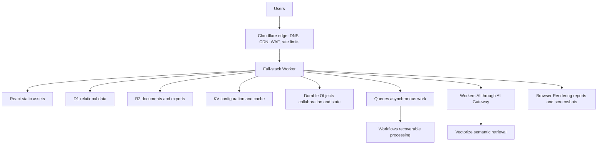

# Architecture

## System context

Users reach a single full-stack Cloudflare Worker through Cloudflare edge protection. The Worker serves the React application, enforces API policy, implements business logic, and integrates with platform bindings.



D1, R2, KV, and Queues are configured in the implemented development slice. Durable Objects, Workflows, Workers AI, AI Gateway, Vectorize, and Browser Rendering remain target-state extension points.

## Application boundary

Use one deployed Worker initially, with logical modules for client, routes, middleware, services, workflows, and stateful components. Split deployment units only when scaling, isolation, security, ownership, or independent lifecycle requirements justify it.

## Data allocation

- D1: projects, members, nodes, relationships, technologies, decisions, risks, document metadata, workflow runs, and audit events
- R2: source documents, images, exports, screenshots, and backups
- KV: feature flags, public configuration, themes, and disposable cached lookups
- Durable Objects: one authoritative owner for collaboration rooms, WebSockets, agent sessions, and coordinated counters

## Document ingestion target state

1. Validate identity, authorization, metadata, and content constraints.
2. Store the original in R2 and metadata in D1.
3. Enqueue an ingestion message.
4. Run a recoverable workflow to extract, chunk, and embed content.
5. Store vectors in Vectorize, update D1 status, and write an audit event.

No long-running ingestion should block the upload HTTP request.

## AI target state

The assistant loads structured project context from D1, retrieves cited content from Vectorize/R2, invokes models through AI Gateway, and persists only necessary conversation state. Consequential actions require explicit human approval. Deterministic validation remains deterministic code.

## Security

- Project, sports-car, and technology APIs require authentication.
- Cloudflare Access application JWTs are verified by the Worker in Access mode.
- Viewer and Publisher can read projects; Architect and Administrator can create and edit them.
- Every protected endpoint performs server-side authorization.
- Bindings and credentials never enter browser bundles.
- Responses use security headers and structured, non-sensitive errors.

## Environments

Local, development, preview, and production use separate Cloudflare resources. Preview builds never connect to production D1, R2, KV, Queues, Vectorize, or Durable Objects. The checked-in development configuration references only the isolated `cloudflare-architecture-lab-dev*` resources.

## Initial component layout

```text
src/client/components/ui/                  locally owned shadcn primitives
src/client/components/architecture-lab/    product-specific patterns
src/client/features/                       feature pages and state
src/worker/middleware/                     policy and request context
src/worker/routes/                         HTTP routes
src/worker/services/                       application and binding adapters
migrations/                                D1 schema history
tests/                                     unit and integration coverage
```
